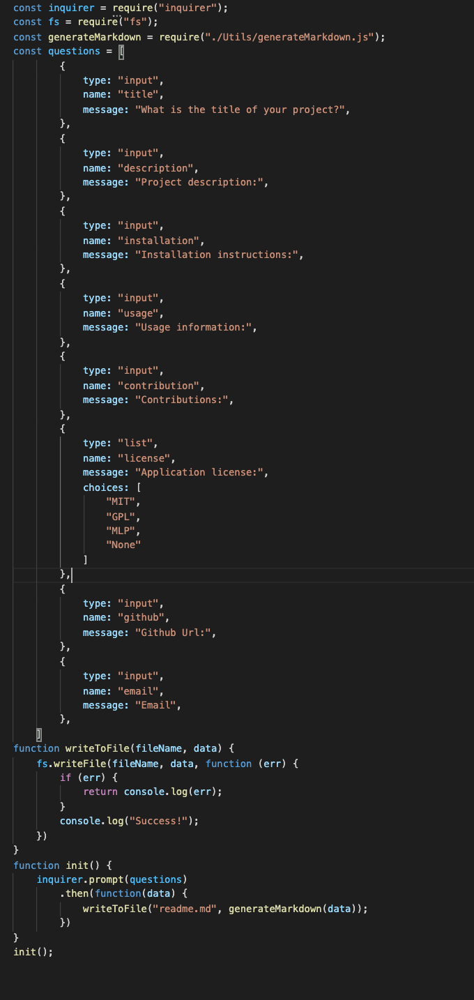

# Readme Generator

   # Description
   A simple command line application in order for the user to create professional yet quikc readme files

   

   ## Table of Contents
   1. Installation
   2. Usage
   3. Contributors
   4. Test
   5. License
   6. Contact
  

   # Installation

   Please install inquirer and FS

   # App Usage

   PLease use within terminal

   # Contributors

   none

   # License

   MIT

   # Contact

   Github:github.com/joemc9011

   Email: joemc9011@gmail.com

